Задание 1.

    1. Проект изучен.
   
    2. Файл  "personal.auto.tfvars" заполнен.

    3. Итог вывода terraform apply

Задание 2.

    1. Создан фойл "count-vm.tf"
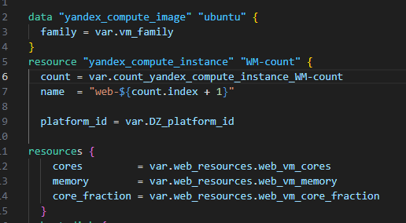
    
    2.Создан файл "for_each-vm.tf"
    
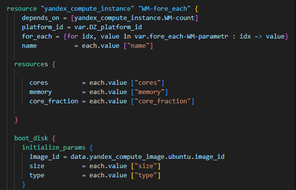
    
    2. Машины из пункта 2 запускаютсья после создания машин из пункта 1
 
    
    3. SSH передается при помощи функции "file" в local-переменной
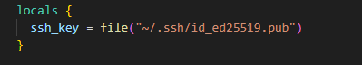
    
    4. Итог вывода terraform apply

    

Задание 3.

    1. Созданы 3 виртуальных диска.
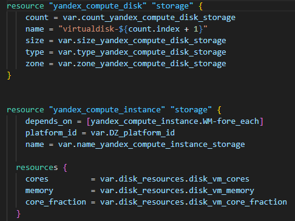

    2. Создана виртуальная машина storage
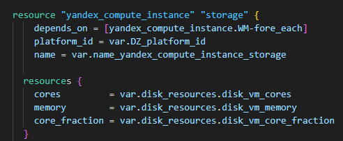

    3. Диски подключенны
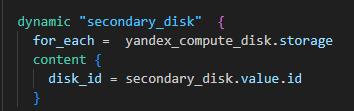  

    4.Итог вывода terraform apply
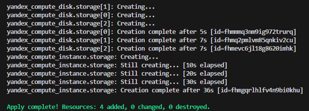
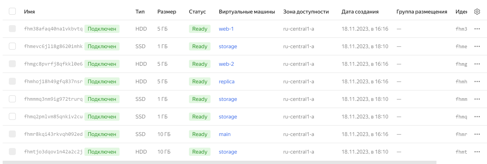

Задание 4.

    1. Создан "ansible.tf"

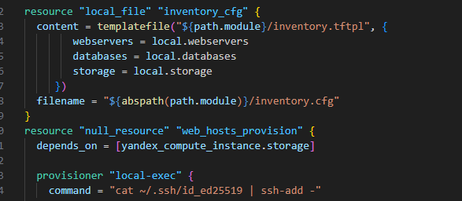

    2. Создан файл "inventory.tftpl"

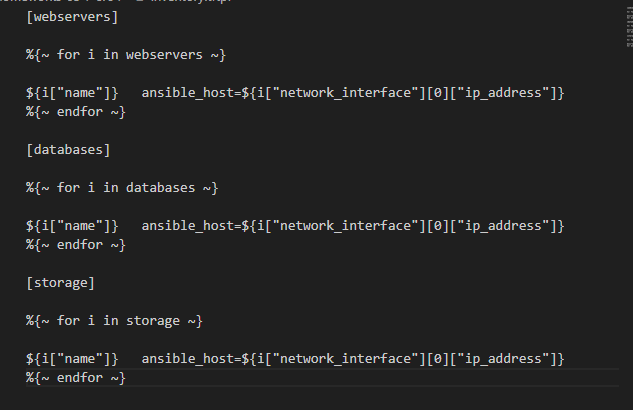

    3. Итог вывода terraform apply

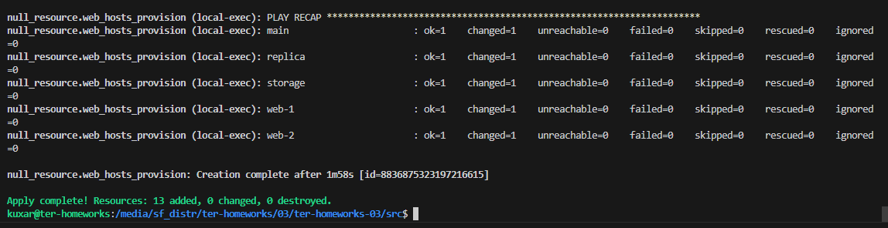

Задание 5.

    1.Создан файл "outputs.tf"

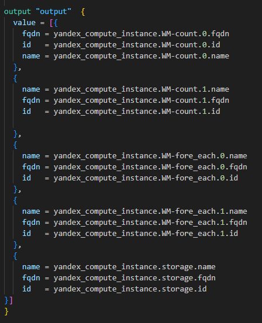

    2. Итог вывода terraform refresh, output
   
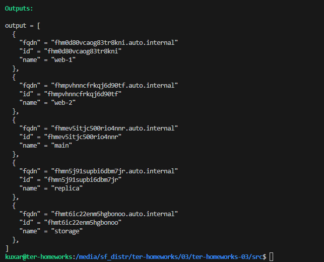

Задание 6.

    1. Отключяем "nat" в настройках сетевого адаптера
   
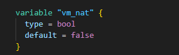
    
    2. Изменяем файл "inventory.tftpl" "nat_ip_address" на "ip_address"

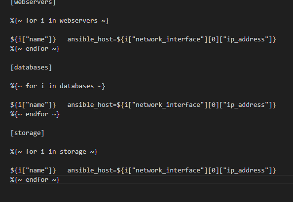

    3. Итог вывода terraform apply

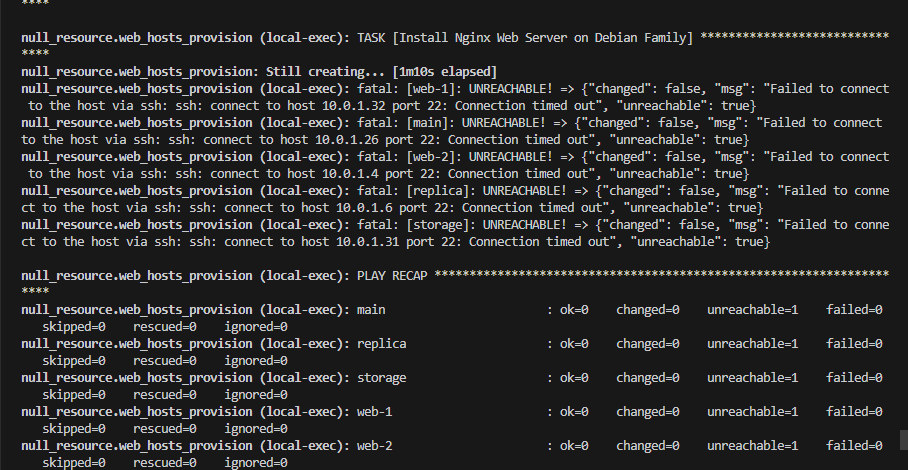